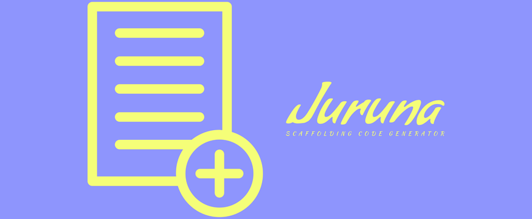

## Paulo Luan's juruna (FrontEnd Monorepo)



<span id="top"></span>

<p align="center">
    <a href="#"></a>
</p>

<p align="center">
    <a href="https://github.com/PauloLuan/juruna/actions/workflows/ci.yml"></a>
    <a href="https://pt-br.reactjs.org/"></a>
    <a href="https://nodejs.org/en/"></a>
</p>

## 💡 Introduction

PauloLuan juruna-monorepo

## 📝 Minimal Requirements

- NodeJS 16.x

## 🚀 Install

```sh
$ git clone https://github.com/pauloluan/juruna.git
```

Just type install and the app magically will execute the lerna bootstrap command and the apps are gonna build for the first time: 

```sh
$ yarn install
```

This will start all packages in development mode in parallel

```sh
$ yarn dev
```

If you wanna checkout the storybook components you have to run:

```sh
$ yarn storybook
```

For unit tests:

```sh
$ yarn test
```

For more commands please checkout the scripts section on `package.json`

[![travis-image][travis-image]][travis-url] [![Dependency Status][daviddm-image]][daviddm-url] [![standard][standard-image]][standard-url] [![forthebadge][itworks-image]][itworks-url]

[travis-image]: https://img.shields.io/travis/pauloluan/juruna/master.svg?style=for-the-badge
[travis-url]: https://travis-ci.com/pauloluan/juruna
[daviddm-image]: https://img.shields.io/david/pauloluan/juruna.svg?style=for-the-badge
[daviddm-url]: https://david-dm.org/pauloluan/juruna
[standard-image]: https://img.shields.io/badge/code%20style-standard-brightgreen.svg?style=for-the-badge
[standard-url]: http://npm.im/standard
[itworks-image]: https://forthebadge.com/images/badges/it-works-why.svg
[itworks-url]: https://forthebadge.com

# Where you can find me? :man_technologist:

[](https://bit.ly/pauloluan)

[🔝 back to top](#top)
